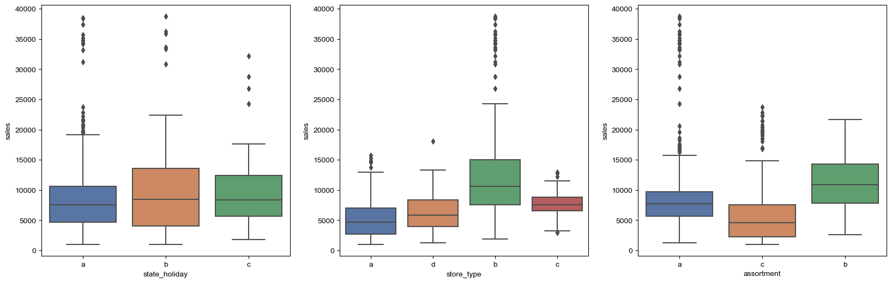
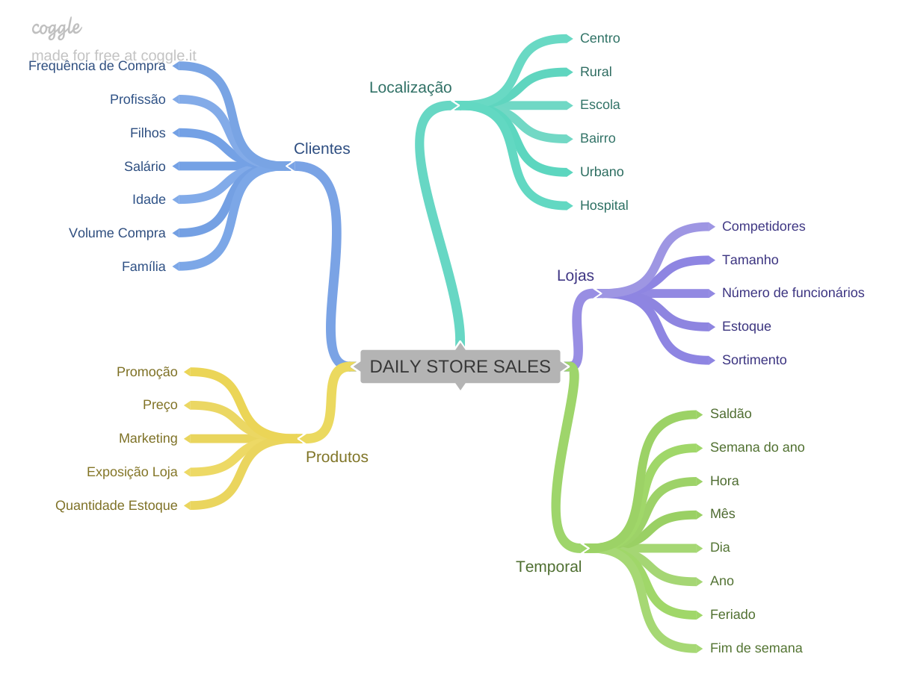
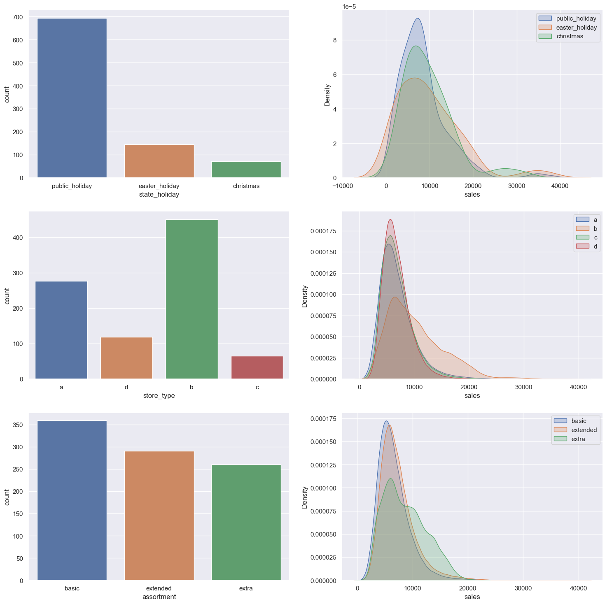
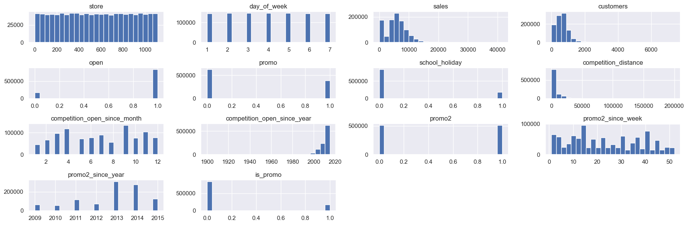
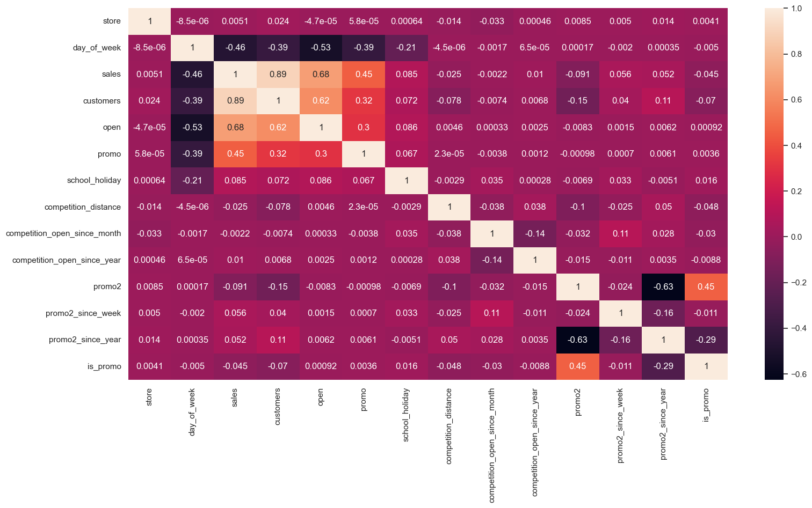
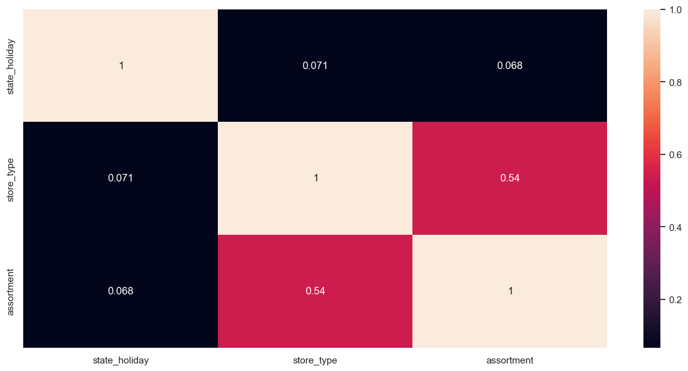

# Rossmann Sales Predict

###### This project has academic purposes.
# 

# Business Problem

Rossmann's is a big European drugstore. Some store managers call me to help them to predict sales for the next six weeks.
The root cause is a demand from the CFO, discussed at their weekly meeting: he needed to plan store renovations, and for that, the budget needs to be aligned with each store's sales.
Therefore, the principal stakeholder is the CFO, but from which all store managers will benefit.

## About the Dataset
- Number of rows:  **1017209**
- Number of columns:  **18**

##  Business Assumptions

- '**competition_distance**': applied the value of 200,000 of NaN values to guarantee more data (Max value identified: 75860.0)
- '**competition_open_since_month**': fill NaN values with the month of 'date'
- '**competition_open_since_year**': fill NaN values with the month of 'date'
- '**promo2_since_week**': fill NaN values with the week of 'date'
- '**promo2_since_year**': fill NaN values with the year of 'date'
- '**promo_interval**': fill NaN values with 0
- '**month_map**': change the integer value of month('date') to string in words (Jan, Feb, Mar...)
- '**is_promo**': 0 if 'promo_interval' = 0 and 1 if there is any month present in 'month_map'

## Feature Engineering

Features to create:
- '**year**': `year of 'date' in integer`
- '**month**': `month of 'date' in integer`
- '**day**': `day of 'date' in integer`
- '**week_of_year**': `weekofyear of 'date' in integer`
- '**year_week**': `string format ('%Y-%W') of 'date'`
- '**competition_since**': `apply datetime considering (year = 'competition_open_since_year', month =  competition_open_since_month', day = 1)`
- '**competition_time_month**': `amount of days based on (('date' - 'competition_since') / 30)`
- '**promo_since**': `concat('promo2_since_year', '-', 'promo2_since_week')`
- '**promo_since**': `transform 'promo_since' in datetime format and decrease 1 week`
- '**promo_time_week**': `amount of days based on (('date' - 'promo_since') / 7)`
- '**assortment**': `'basic' if 'a' else 'extra' if 'b' else 'extended'`
- '**state_holiday**': `'public_holiday' if 'a' else 'easter_holiday' if 'b' else  'christmas' if  'c' else 'regular_day'`

## Data Filtering

- Consider **only opened stores**: `'open' != 0`
- Consider **only stores with positive sales**: `'sales' > 0`
- **Drop columns** those don't have use case: `['customers','open','promo_interval','month_map']`

## Univariate Analysis

> Part 1

- **Highly** concentrated in **PUBLIC HOLIDAY**
- There's no **significant** difference in **SALES** with the **category variables**;
- **Highly** concentrated in **STORE B**

> Part 2

## Hipothesis Created
> Store

**1.** Stores with more assortment should sell more
**2.** Store with closer competitors shoudl sell less
**3.** Stores with long period competitors should sell more

> Product

**4.** Stores with longer active promotions should sell more
**5.** Stores with more days of promotions should sell more
**6.** Stores with more consecutive promotions should sell more

> Time

**7.** Stores should sell more after day 10 of each month
**8.** Stores should sell less on weekends
**9.** Stores should sell less in scholar holidays

## Hipothesis Evaluated
| ID  | Hypothesis                                                | Conclusion |
|:----:|:---------------------------------------------------------|:-----------|
| H1  | Stores with more assortment should sell more              | FALSE |
| H2  | Store with closer competitors shoudl sell less            | FALSE |
| H3  | Stores with long period competitors should sell more      | FALSE |
| H4  | Stores with longer active promotions should sell more     | FALSE |
| H5  | Stores with more days of promotions should sell more      | FALSE |
| H6  | Stores with more consecutive promotions should sell more  | FALSE |
| H7  | Stores should sell more after day 10 of each month        | TRUE |
| H8  | Stores should sell less on weekends                       | TRUE |
| H9  | Stores should sell less in scholar holidays               | TRUE |

## Multivariate analysis

> Key points:
- **open** and **sales**: `high positive correlation`
- **open** and **customers**: `high positive correlation`
- **promo** and **sales**: `moderate positive correlation`
- **promo** and **customers**: `moderate positive correlation`
- **promo** and **open**: `moderate positive correlation`

> Key points:
- **assortment** and **store_type**: moderate positive correlation

## Data Preparation

- **RobustScaler**: 'competition_distance' and 'competition_time_month'
- **MinMaxScaler**: 'promo_time_week' and 'year'
- **OneHotEncoding**: pandas dummies in 'state_holiday'
- **LabelEncoding**: 'store_type'
- **OrdinalEncoding**: 'assortment with these values {'basic': 1, 'extra': 2, 'extended': 3}
- **Target Transformation**: change the dimension of 'sales' in log1p( 'sales' )
- **Nature Transformation**: due these variables be cyclical
    - '**day_of_week_sin**': lambda x: np.sin( x * (2 * np.pi / 7 ) ) 
    - '**day_of_week_cos**': lambda x: np.cos( x * (2 * np.pi / 7 ) ) 
    - '**month_sin**': lambda x: np.sin( x * (2 * np.pi / 12 ) ) 
    - '**month_cos**': lambda x: np.cos( x * (2 * np.pi / 12 ) ) 
    - '**day_sin**': lambda x: np.sin( x * (2 * np.pi / 30 ) ) 
    - '**day_cos**': lambda x: np.cos( x * (2 * np.pi / 30 ) ) 
    - '**week_of_year_sin**': lambda x: np.sin( x * (2 * np.pi / 52 ) ) 
    - '**week_of_year_cos**': lambda x: np.cos( x * (2 * np.pi / 52 ) ) 

## Feature Selection
- **Remove** columns: `['week_of_year', 'day', 'month', 'day_of_week', 'promo_since', 'competition_since', 'year_week']`
- **Train** dataset: data in the condition -> `'date' < '2015-06-19'`
- **Test** dataset: data in the condition -> `'date' >= '2015-06-19'`
- Columns selected (Boruta): `['store','promo','store_type','assortment','competition_distance','competition_open_since_month','competition_open_since_year','promo2','promo2_since_week','promo2_since_year','competition_time_month','promo_time_week','day_of_week_sin','day_of_week_cos','month_cos','month_sin','day_sin','day_cos','week_of_year_sin','week_of_year_cos']`
- Added columns: `['date','sales']`

## Machine Learning Modeling

- **Baseline model** created: used the mean('`sales`') as '`predictions`' in the `test dataset`
- Models tested:
    - **Linear Regression** (standard values)
    - **Lasso** (`alpha = 0.01`)
    - **Random Forest Regressor** (`n_estimators=100, n_jobs=2, random_state=42`)
    - **XGBRegressor** (`objective = 'reg:squarederror',n_estimators=100, eta = 0.01, max_depth = 10, subsample = 0.7, colsample_bytree = 0.9`)

## Tuning

- **Model chosen: XGB** (fast and light)
- **RandomSeach**: 
    - **param** = {'**n_estimators**': `[1500, 1700,2500, 3000, 3500]`,'**eta**': `[0.01, 0.03]`,'**max_depth**': `[3, 5, 9]`,'**subsample**': `[0.1, 0.5, 0.7]`,'**colsample_bytree**': `[0.3, 0.7, 0.9]`,'**min_child_weight**': `[3, 8, 15]`}

- **Tuned** values:
    - **param_tuned** = {'**n_estimators**':`3000`,'**eta**': `0.03`,'**max_depth**': `5`,'**subsample**': `0.7`,'**colsample_bytree**': `0.7`,'**min_child_weight**': `3`}

## Business Performance

- Applied '**MAPE**' and '**MAE**' metrics
- Created '**worst_scenario**': '**predictions**' - '**MAE**'
- Created '**best_scenario**': '**predictions**' + '**MAE**'

- **Performance by stores**

- **Total performance**: sumarize all scenarios

- **Error rate**

## Deployment

- **Model** deployed on **Heroku**, with **Flask** and **requests**
- Created a **Telegram Bot** to send the **Store code** to receive the **predictions of the next 6 weeks** 